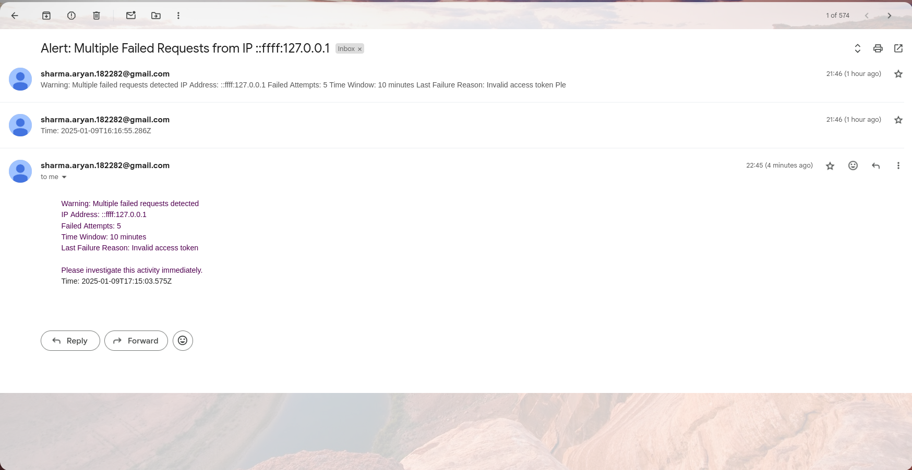

# Request Monitoring and Alerting System

A robust Node.js/TypeScript service that monitors HTTP requests, tracks failed attempts, and sends alerts based on configurable thresholds. Built with Express.js and MongoDB, this system helps protect your APIs by monitoring and alerting on suspicious activity.

## Features

- 🔍 Monitors failed POST requests due to invalid headers or access tokens
- 📊 Tracks failed requests by IP address within configurable time windows
- ⏰ Configurable alert thresholds and monitoring periods
- 📧 Email notifications for security alerts using SMTP
- 📈 Metrics endpoint for monitoring and analysis
- 🔒 IP-based tracking and rate limiting

## Prerequisites

- Node.js (v14 or higher)
- MongoDB
- npm or yarn
- Gmail account (for email notifications)

## Installation

1. Clone the repository:

```bash
git clone <repository-url>
cd alerting-system
```

2. Install dependencies:

```bash
npm install
```

3. Create a `.env` file in the project root:

```env
MONGODB_URI=mongodb://localhost:27017/request-monitor
SMTP_USER=your-gmail@gmail.com
SMTP_PASS=your-app-specific-password
ALERT_RECIPIENTS=admin@example.com
VALID_TOKEN=your-valid-token
```

4. Build the project:

```bash
npm run build
```

## Configuration

The system can be configured through environment variables and the `config.ts` file:

- `timeWindowMinutes`: Time window for tracking failed attempts (default: 10)
- `maxFailedAttempts`: Number of failures before triggering alert (default: 5)
- `MONGODB_URI`: MongoDB connection string
- `SMTP_USER`: Gmail account for sending alerts
- `SMTP_PASS`: Gmail app-specific password
- `ALERT_RECIPIENTS`: Comma-separated list of email addresses to receive alerts
- `VALID_TOKEN`: Valid authentication token for testing

## Usage

1. Start the server:

```bash
npm run dev    # Development mode
npm start      # Production mode
```

2. Test the endpoints:

Valid request:

```bash
curl -X POST http://localhost:3000/api/submit \
  -H "Authorization: Bearer your-valid-token" \
  -H "Content-Type: application/json" \
  -d '{"test": "data"}'
```

Check metrics:

```bash
curl http://localhost:3000/api/metrics
```

## API Endpoints

### POST /api/submit

Protected endpoint for testing the monitoring system.

Headers:

- `Authorization`: Bearer token
- `Content-Type`: application/json

### GET /api/metrics

Retrieve monitoring metrics and statistics.

Query Parameters:

- `startTime`: ISO date string
- `endTime`: ISO date string

## Development

1. Run in development mode:

```bash
npm run dev
```

2. Build the project:

```bash
npm run build
```

## Testing

Run the test suite:

```bash
npm test
```

Manual testing script:

```bash
# Test invalid requests
for i in {1..5}; do 
  curl -X POST http://localhost:3000/api/submit \
    -H "Authorization: Bearer wrong-token" \
    -H "Content-Type: application/json" \
    -d '{"test": "data"}';
  sleep 1;
done
```

## Project Structure

```
├── src/
│   ├── config.ts           # Configuration
│   ├── app.ts             # Application entry
│   ├── models/            # Database models
│   ├── services/          # Business logic
│   └── middleware/        # Express middleware
├── dist/                  # Compiled code
├── .env                   # Environment variables
└── package.json          # Dependencies
```


